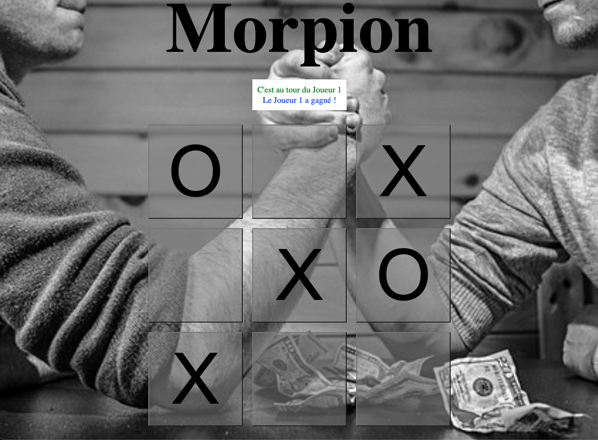

# :dart: Jeu de Morpion (Tic-Tac-Toe)

Ce projet est une implémentation web simple du jeu classique Morpion (Tic-Tac-Toe), permettant à deux joueurs de jouer tour à tour sur un seul appareil.

## 📑 Description

Le jeu de Morpion se joue sur une grille de 3x3 cases. Deux joueurs s'affrontent et marquent à tour de rôle les cases de la grille avec leur symbole respectif, "X" pour le Joueur 1 et "O" pour le Joueur 2. Le gagnant est le premier joueur à aligner trois de ses symboles horizontalement, verticalement ou diagonalement. Si la grille est complètement remplie sans qu'aucun joueur n'ait aligné trois symboles, la partie est déclarée nulle.

## 💻 Technologies Utilisées
- JavaScript
- HTML
- CSS
  
## 📝 Fonctionnalités

- Interface simple et interactive pour jouer au Morpion.
- Affichage du joueur actuel et des messages de fin de jeu.
- Bouton de réinitialisation pour commencer une nouvelle partie sans recharger la page.

## :no_entry_sign: Installation

Aucune installation n'est nécessaire. Pour jouer, ouvrez simplement le fichier `index.html` dans votre navigateur web.

## :game_die: Utilisation

1. Le jeu commence avec le Joueur 1 ("X"). Cliquez sur une case vide pour y placer votre symbole.
2. Les joueurs jouent à tour de rôle jusqu'à ce qu'un joueur gagne ou que toutes les cases soient remplies, ce qui résulte en un match nul.
3. Utilisez le bouton "Recommencer" pour initialiser une nouvelle partie à tout moment.

### 🤝 Contribution

Toute contribution est la bienvenue ! Si vous souhaitez contribuer, n'hésitez pas à soumettre une pull request.

## 📫 Contact

Pour toute question ou suggestion, n'hésitez pas à me contacter. semprini.anthony@gmail.com

Try => https://morpions-js.netlify.app/

